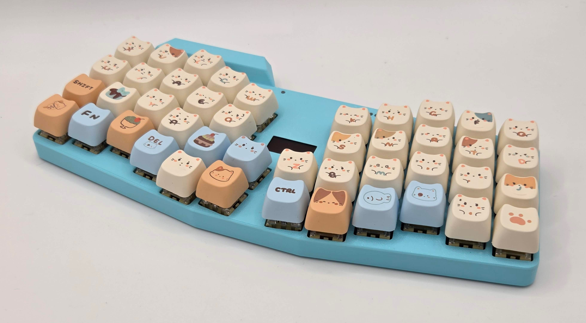

################
CATreus
################




A wireless keyboard based on the Keyboardio Atreus.

* NRF54L15 Bluetooth SoC (HolyIOT module)
* NPM1300 PMIC for battery management
* 14500 li-ion battery (900mAh)
* 128x64 OLED display (SSD13060based)
* 4 status LEDs, 1 charge LED
* 3D printed [case](/case)
* custom [firmware](/kbd_firmware)
* Kailh Midnight Pro Silent Switches
* MAO profile keycaps ([from Aliexpress](https://www.aliexpress.com/item/1005008664883621.html))

Key layout is hardcoded in the firware, I'm using a NEO2 based layout.

Notes
-------

Programmed via the 5 holes on the top next to the leds, using a custom pogo pin connector. 
Spacing is 2.54mm, so can just solder pogo pins to a piece of protoboard.
pinout:
```
NC    RESET   GND
3V3   SWDIO   SWCLK
```

Wake button is top left of the center 4 buttons, used to wake the keyboard from sleep mode (30min of inactivity).
UI help by pressing wake + H.

CMD & CTRL keys can be swapped with wake + W for use on Windows/Mac this is persisted per bluetooth connection.
